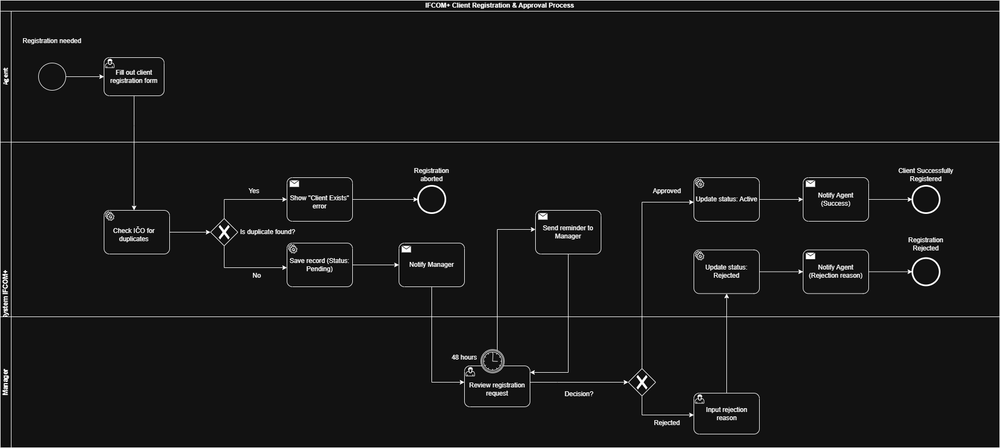

# 🏢 InsuCorp (IFCOM+) — Enterprise Insurance CRM Modernization

## 📖 Business Context & Project Overview
**POJFIRM** is a commercial insurance provider operating in the Czech Republic, specializing in B2B insurance products for enterprises and local businesses. 

The company is migrating from its legacy, slow, and restricted desktop application (**IFCOM**) to a modern, cloud-based, and highly responsive web platform (**IFCOM+**). 

### 🛑 The Problem (AS-IS Pain Points)
* **Operational Inefficiency:** Field sales agents lack direct access to the legacy CRM system. They are forced to fill out complex paper forms with clients, mail them to the home office, and wait days for manual data entry.
* **Data Corruption & Duplicates:** Manual transcription of paper forms leads to frequent typos. Without real-time verification, agents routinely register duplicate company profiles or offer insurance products that the client already owns.
* **Process Bottlenecks:** The contract approval (schvalování) workflow is opaque, leading to delays and lost sales opportunities due to stagnant applications.

### 🎯 Project Objectives & Business Value (TO-BE Target State)
* **100% Paperless Workflows:** Equipping field agents with a responsive web-app to onboard clients directly from tablets/mobile devices.
* **Data Integrity & Prescriptive Validation:** Eradicating database clutter via automated real-time checks (e.g., duplicate IČO lookup).
* **Role-Based Governance:** Securing commercial data visibility across multiple organizational layers (Agents, Regional Managers, Admins) in compliance with GDPR.

---

## 💻 My Role & Analytical Scope
As the **Junior Business & Systems Analyst** on this modernization initiative, I was responsible for transforming high-level business needs into strict technical requirements and functional designs. My deliverables included:
1. **Process Modeling:** Designing robust target-state workflows using BPMN 2.0.
2. **Access Control Engineering:** Defining granular data visibility profiles via a CRUD/RBAC matrix.
3. **Requirements Engineering:** Authoring testable Gherkin-style BDD User Stories for the development team.

---

## ⚙️ 1. Process Architecture (To-Be)
To secure clean client onboarding and handle process stagnation, I modeled the automated validation and approval lifecycle using the **BPMN 2.0** standard. 

The workflow handles edge cases such as instant duplicate rejection and automated managerial reminder loops (48-hour SLA timers).



---

## 🔐 2. Security & Data Visibility (RBAC / CRUD Matrix)
Insurance data governance requires strict row-level and table-level access controls based on the organizational hierarchy (Region -> Org Unit/Sales Point). 

Below is the designed functional specification for security domains:

| Entity / Domain | Agent | Manager | System Administrator |
| :--- | :--- | :--- | :--- |
| **Client Profile (Registration)** | **C**, **R** (If owner OR same Org Unit), **U** (If owner) | **C**, **R** (Direct reports & subordinate units), **U** (If owner OR reassigning) | None |
| **Registration Status (Approval)** | **R** (View status only) | **U** (Approve/Reject transitions) | None |
| **Insurance Products (Policies)** | **C**, **R**, **U** (Deactivate) for owned clients | **C**, **R**, **U** (Deactivate) for subordinate clients | None |
| **Organizational Units (Hierarchy)** | **R** (Own unit details only) | **R** (Own unit & sub-units) | **C**, **R**, **U**, **D** (Deactivate) |
| **System Users (Workers/Staff)** | **R** (Peers in the same Org Unit) | **R** (Direct reports) | **C**, **R**, **U** (Role/Unit assignment) |
| **Managerial Reports / Dashboards** | None | **R** (Performance metrics for team) | None |
| **System Audit Logs (GDPR)** | None | None | **R** (Export only) |

*\*Key: C = Create, R = Read, U = Update, D = Delete*

---

## 📝 3. Requirements Engineering (BDD User Stories)
To ensure immediate readiness for development and seamless QA alignment, agile requirements are specified as User Stories detailed via **Gherkin syntax (Given-When-Then)**.

### US-1.02: Prevent Duplicate Client Registration
**Epic:** Client Onboarding & CRM Core  
**Functional Ref:** FR_1.02, FR_1.01  

#### Story Statement
> **As an** Agent,  
> **I want** the system to automatically check if a company already exists based on its IČO before saving a new registration,  
> **So that** I do not create duplicate records and the database integrity is maintained.

#### Acceptance Criteria
```gherkin
Scenario 1: Successful Registration (Happy Path)
  Given the Agent is on the "New Client Registration" form
  And the Agent enters an IČO (e.g., "12345678") that does NOT exist in the IFCOM+ database
  When the Agent clicks the "Submit" button
  Then the system should save the new client record with the status "Pending Approval"
  And the system should route the request to the respective Manager's queue

Scenario 2: Duplicate IČO Detected (Negative Path)
  Given the Agent is on the "New Client Registration" form
  And the Agent enters an IČO (e.g., "87654321") that ALREADY exists in the IFCOM+ database
  When the Agent clicks the "Submit" button
  Then the system should prevent the form submission
  And display a validation error: "A client with this IČO is already registered in the system."

Scenario 3: Invalid IČO Format (Edge Case / Data Validation)
  Given the Agent is on the "New Client Registration" form
  When the Agent enters an IČO that contains letters or is not exactly 8 digits long
  Then the system should disable the "Submit" button
  And display a validation error: "IČO must contain exactly 8 numeric digits."
```
## 🗄 4. Data Architecture (Data Dictionary)
To support the new CRM core and the automated validations, I designed the baseline data structure for the primary entity. This ensures database integrity and aligns with the BPMN workflow statuses.

### Entity: `Client_Profile`
**Description:** Stores the core registration data for B2B clients.

| Attribute Name | Data Type | Constraints | Description |
| :--- | :--- | :--- | :--- |
| `client_id` | UUID | Primary Key, Auto-generate | Unique identifier for the client record. |
| `company_name` | VARCHAR(255) | NOT NULL | Legal name of the registered company. |
| `ico` | VARCHAR(8) | NOT NULL, UNIQUE | 8-digit Czech Company ID. Unique constraint prevents duplicates (Ref: US-1.02). |
| `registration_status` | ENUM | Default: 'Pending' | Valid values: `Pending`, `Active`, `Rejected`. Driven by approval workflow. |
| `rejection_reason` | TEXT | NULLABLE | Populated only if `registration_status` = 'Rejected' by the Manager. |
| `assigned_agent_id` | UUID | Foreign Key, NOT NULL | Links to the `Users` table. Identifies the creator/owner. |
| `assigned_manager_id`| UUID | Foreign Key, NOT NULL | Links to the `Users` table. Used for RBAC visibility and approval routing. |
| `created_at` | TIMESTAMP | Default: CURRENT_TIMESTAMP| Record creation timestamp for audit purposes. |
